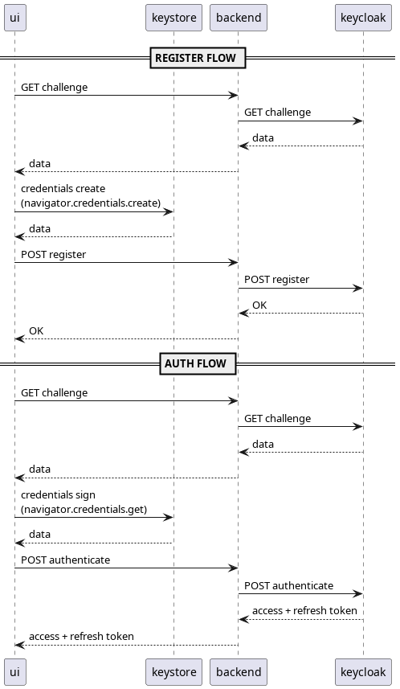

# Keycloak Strong Authentication Implementation

This proof of concept demonstrates setting up strong authentication from scratch using Keycloak as the identity provider.

## Architecture Components

- **Frontend UI**: JavaScript-based web application that handles user interactions and authentication flows. See <code>./ui</code> folder
- **Credential Storage**: Browser's native `navigator.credentials` API for secure credential management
- **Backend Service**: NestJS application server that validates authentication and manages protected resources. See <code>./backend</code> folder
- **Identity Provider**: Keycloak version 26.0.4 for centralized authentication and authorization. See <code>./keycloak</code> folder. <code>./keycloak/passkey</code> is the Java SPI custom plugin.

## Overview

This implementation showcases a complete strong authentication system where Keycloak orchestrates the authentication process, the browser securely stores credentials using Web Authentication APIs, and a NestJS backend enforces access control policies.

## Build and run
```bash
docker compose build
docker compose up -d
```

Data are imported from realm for this simulation. Please, <b>change credentials</b> before any integration

### Admin console
http://localhost:8080/admin/master/console

```
username: admin
password: 64e391390d11624048c4d0be
```

### Account console
http://localhost:8080/realms/sa/account

```
username: alberto
password: alberto
```

### Client
```
client_id: sa-client
client_secret: UO7ZdPpxQPzvld7TyG9vUJEXBtMmpoHG
```

### UI
http://localhost with username <code>alberto</code>.

### Full backup
```bash
docker compose run --name keycloak-export-temp keycloak export --dir /tmp/export --users same_file
# all backup files will be placed inside <localdir>
docker cp keycloak-export-temp:/tmp/export ./<localdir>
# when the docker is stopped copy from <localdir> to keycloak/import/
```


## Flow
Here the server to server flow



## Browser
To simulate ctap2 protocol and usb transport it's used chromium puppeteer with simulation.

It's not mandatory, you can you whatever you like.

```bash
cd browser
npm i
npm run start
```
